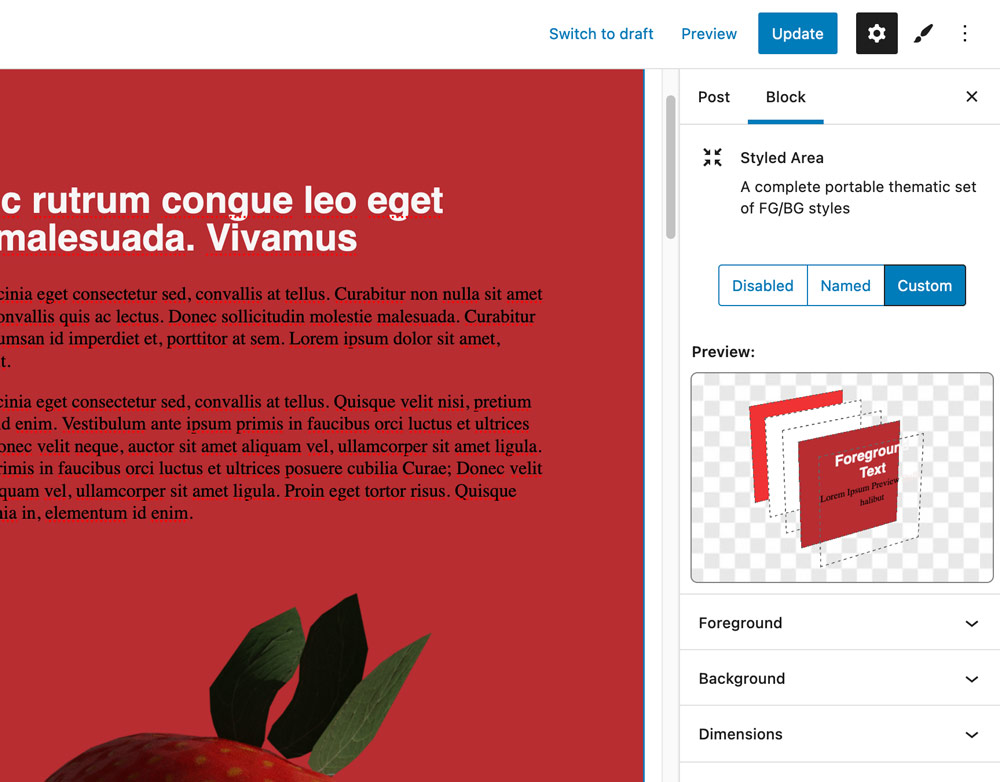

# Styled Areas - Gutenberg Block
This codebase contains a WP/Gutenberg plugin which provides the user with a new "Styled Area" block. A Styled Area is a container element which can be assigned foreground/background styles, and can accept [InnerBlocks](https://developer.wordpress.org/block-editor/how-to-guides/block-tutorial/nested-blocks-inner-blocks/). This is meant to replicate a common design pattern where bands of content span the full width of the site. 



## Installation

1. Download this repo and add the "xx-styled" directory to the "plugins" directory of your WordPress installation `/wp-content/plugins/`
2. Activate the plugin through the 'Plugins' screen in WordPress
3. New controls/editors are now available


## Description

The block is capable of being used in multiple ways: 

1. **Inline Styles** - the container element is inserted directly into your post and saved in `post_content` (like most block content). This code contains CSS custom properties inside that element's `style` tag.

2. **Saved/Reusable Styles** - these are edited as entries in a traditional WP Post Editor. Now you can create styles and reuse them in multiple places throughout your site.Instead of inlining the CSS, a reference will be placed on the container: `<div data-theme="my-cool-style">`

3. **Post Styles** - Saved Styles can also be assigned at a high level to a Post/Page (in addition to inside the Gutenberg editing interface). Nothing will added to the entry in the Gutenberg editor, but a callback function allows a named style to be added to a high-level page element: `<body data-theme="my-cool-style">`


<!-- 
There is default support if you create light/dark modes:

```
<body data-theme="custom">
<body data-theme="light">
<body data-theme="dark">
``` -->


## Benefits
This approach may help some users style their theme more consistently and dynamically by simplifying how color is added to container blocks and inner elements (p,h1,etc) without controlling each one individually.


## Added Routes
In addition to the 'single' view created by the 'styled' posttype, additional helper urls are added.

### CSS
- Individual Styles - `WPBASE/style/taffy.css` (slug is used)
- All Styles - `WPBASE/style/compiled.css` (special name 'compiled' is used)
<!-- - Entry Styles - `WPBASE/styled-entry/[ID].css` (ID is used, this will pluck any used inline/saved styles and place them in a compiled CSS format) -->

### JSON
- Individual JSON - `WPBASE/style/taffy.json` (returns object)
- Compiled JSON - `WPBASE/style/compiled.json` (returns arrray of objects). This is used in creating variations.


## Styled Areas versus 
is an alternative approach to using the core styling tools in WordPress.