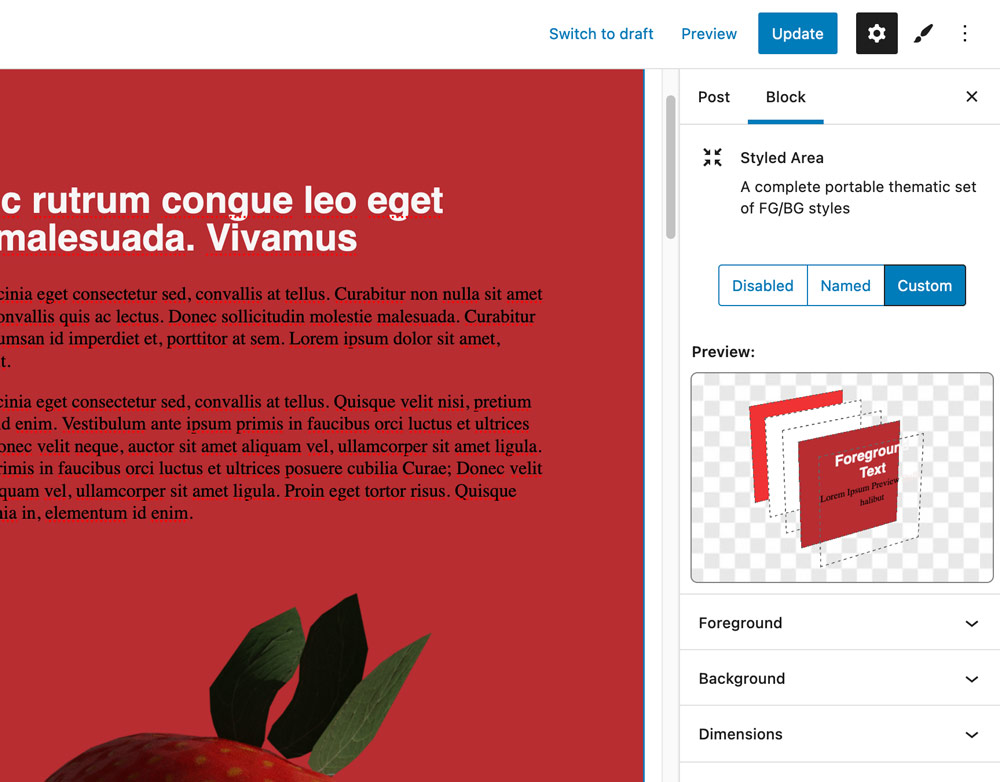

# Styled Areas - Gutenberg Block
"*Styled Areas*" is a WordPress Plugin which provides the user with an alternative visual-editing interface for creating color-themes inside of a WP website using a new *Block* and *Posttype*. 



Practically speaking, a Styled Area is a container element which uses CSS Variables for displaying foreground/background colors on the content inside of it. To make this even more powerful, Styled Areas can be saved, reused, and assigned to a post/page level.

## Installation

1. Download this repo and add the entire "xx-styled" directory to the "plugins" directory of your WordPress installation `/wp-content/plugins/`
2. Activate the plugin through the 'Plugins' screen in WordPress
3. New controls/editors are now available! A new "Styled Areas" posttype in the admin sidebar, a block called "Styled Area" available in the block editor, and a sidebar plugin for managing post styles.


## Description

The block is capable of being used in multiple ways: 

1. **Inline Styles** - the container element is inserted directly into your post and saved in `post_content` (like most block content). This code contains CSS custom properties inside that element's `style` tag.

2. **Saved/Reusable Styles** - these are edited as entries in a traditional WP Post Editor. Now you can create styles and reuse them in multiple places throughout your site.Instead of inlining the CSS, a reference will be placed on the container: `<div data-theme="my-cool-style">`

3. **Post Styles** - Saved Styles can also be assigned at a high level to a Post/Page (in addition to inside the Gutenberg editing interface). Nothing will added to the entry in the Gutenberg editor, but a callback function allows a named style to be added to a high-level page element: `<body data-theme="my-cool-style">`


## Applying Styles
The inline blocks will have classes like `xx-styled xx-styled--block`. The first class allows the container element access to a set of CSS Variables. With the `xx-styled` class alone there will be no visual changes. To use the variables, apply a second class (in this case `xx-styled--block`).

There is also a class named `xx-styled--hasstyle` which does the same thing. It can be applied to the container itself, or a child. This seperation allows for more deliberate usage. With this technique you can apply styles to a high-level element (like `html` or `body`) but only use the styles in certain islands (areas with .`xx-styled--hasstyle`)

<strong>Opting out:</strong> although it may be useful to pass variables to a lot of elements inside a container, it can also result in some hierarchy issues. You can prevent any element (h1, p, hr, etc) from displaying variables by adding the class `inert` - this is particularly useful for blocks with complexity inside.
<!-- 
There is default support if you create light/dark modes:

```
<body data-theme="custom">
<body data-theme="light">
<body data-theme="dark">
``` -->


## Benefits
This approach may help some users style their theme more consistently and dynamically by simplifying how color is added to container blocks and inner elements (p,h1,etc) without controlling each one individually.


## Additional Routes
In addition to the 'single' entry, additional helper urls are added:

### CSS
- Individual Styles - `WPBASE/styled/my-cool-style.css` (slug is used)
- All Styles - `WPBASE/styled/compiled.css` (special name 'compiled' is used)
<!-- - Entry Styles - `WPBASE/styled-entry/[ID].css` (ID is used, this will pluck any used inline/saved styles and place them in a compiled CSS format) -->

### JSON
- Individual JSON - `WPBASE/styled/my-cool-style.json` (returns object)
- Compiled JSON - `WPBASE/styled/compiled.json` (returns arrray of objects). This is used in creating variations.


## Styled Areas versus Global Styles
I began working on this block in 2019, and it developed alongside the core styling tools in WordPress. While the core WP features focus on 1) Global Styles and 2) inline styles, this project is more focus on streamlining the creation of reusable styles. Both approaches may be useful in different cases!

## Todos
For items that need fixing, see the todo.md file in this project.

## Interesting Blog post
[This article](https://mxb.dev/blog/color-theme-switcher/) is really interesting, and uses a very similar technique.

## Icon Sourcing
Some icons were pasted from [iconify.design](https://icon-sets.iconify.design/?query=globe)